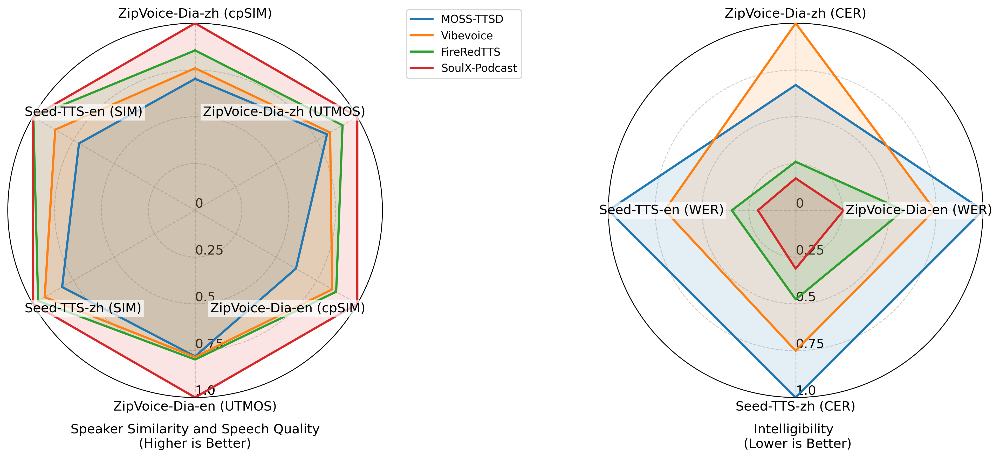

<div align="center">
    <h1>
    SoulX-Podcast
    </h1>
    <p>
    Official inference code for <br>
    <b><em>SoulX-Podcast: Towards Realistic Long-form Podcasts with Dialectal and Paralinguistic Diversity</em></b>
    </p>
    <p>
    <!--  -->
    
    </p>
    <p>
    </p>
    <a href="https://github.com/Soul-AILab/SoulX-Podcast"></a>
    <a href="https://huggingface.co/Soul-AILab"></a>
    <a href="https://arxiv.org/abs/0000.0000"></a>
    <a href="https://github.com/Soul-AILab/SoulX-Podcast"></a>
</div>


<p align="center">
   <h1>SoulX-Podcast: Towards Realistic Long-form Podcasts with Dialectal and Paralinguistic Diversity</h1>
<p>

##  Overview
SoulX-Podcast is designed for podcast-style multi-turn, multi-speaker dialogic speech generation, while also achieving superior performance in the conventional monologue TTS task.

To meet the higher naturalness demands of multi-turn spoken dialogue, SoulX-Podcast integrates a range of paralinguistic controls and supports both Mandarin and English, as well as several Chinese dialects, including Sichuanese, Henanese, and Cantonese, enabling more personalized podcast-style speech generation.


## Key Features 🔥

- **Long-form, multi-turn, multi-speaker dialogic speech generation**: SoulX-Podcast excels in generating high-quality, natural-sounding dialogic speech for multi-turn, multi-speaker scenarios.

- **Cross-dialectal, zero-shot voice cloning**: SoulX-Podcast supports zero-shot voice cloning across different Chinese dialects, enabling the generation of high-quality, personalized speech in any of the supported dialects.

- **Paralinguistic controls**: SoulX-Podcast supports a variety of paralinguistic events, as as ***laugher*** and ***sighs*** to enhance the realism of synthesized results.

<table align="center">
  <tr>
    <td align="center"><br></td>
  </tr>
</table>


## Demo Examples

**Zero-Shot Podcast Generation**
<div align="center">

<https://github.com/user-attachments/assets/a9d3da2a-aaff-49d0-a3c7-2bd3c0b6d5eb>

</div>


**Cross-Dialectal Zero-Shot Podcast Generation**

🎙️ All prompt audio samples used in the following generations are in Mandarin.

🎙️ 以下音频生成采用的参考音频全部为普通话。

<div align="center">

<https://github.com/user-attachments/assets/6bf2b0ad-9b5a-4a21-92d9-b7793dcdd12d>

</div>
<div align="center">

<https://github.com/user-attachments/assets/8571b7b0-52cf-4552-bbed-f5cd88a8949f>

</div>

<div align="center">

<https://github.com/user-attachments/assets/426f05bd-e703-4d3e-bff8-e6549cfe3507>

</div>

For more examples, see [demo page](https://soul-ailab.github.io/soulx-podcast/).

## Install

### Clone and Install
Here are instructions for installing on Linux.
- Clone the repo
```
git clone git@github.com:Soul-AILab/SoulX-Podcast.git
cd SoulX-Podcast
```
- Install Conda: please see https://docs.conda.io/en/latest/miniconda.html
- Create Conda env:
```
conda create -n soulxpodcast -y python=3.11
conda activate soulxpodcast
pip install -r requirements.txt
# If you are in mainland China, you can set the mirror as follows:
pip install -r requirements.txt -i https://mirrors.aliyun.com/pypi/simple/ --trusted-host=mirrors.aliyun.com
```

### Model Download

Download via python:
```python
from huggingface_hub import snapshot_download

# base model
snapshot_download("Soul-AILab/SoulX-Podcast-1.7B", local_dir="pretrained_models/SoulX-Podcast-1.7B") 

# dialectal model
snapshot_download("Soul-AILab/SoulX-Podcast-1.7B-dialect", local_dir="pretrained_models/SoulX-Podcast-1.7B-Dialect") 

```

Download via git clone:
```sh
mkdir -p pretrained_models

# Make sure you have git-lfs installed (https://git-lfs.com)
git lfs install

# base model
git clone https://huggingface.co/Soul-AILab/SoulX-Podcast-1.7B pretrained_models/SoulX-Podcast-1.7B

# dialectal model
git clone https://huggingface.co/Soul-AILab/SoulX-Podcast-1.7B-dialect pretrained_models/SoulX-Podcast-1.7B-Dialect
```


### Basic Usage

You can simply run the demo with the following commands:
``` sh
cd example
# dialectal inference
bash inference_dialog.sh
# monologue inference
bash inference_tts.sh
```

## TODOs
- [ ] Publish the technical report.
- [ ] Develop a WebUI for easy inference.
- [ ] Deploy an online demo on Hugging Face Spaces.
- [ ] Dockerize the project with vLLM support.
- [ ] Add support for streaming inference.

## License

We use the Apache 2.0 license. Researchers and developers are free to use the codes and model weights of our SoulX-Podcast. Check the license at [LICENSE](LICENSE) for more details.


## Acknowledge
- This repo benefits from [FlashCosyVoice](https://github.com/xingchensong/FlashCosyVoice/tree/main)


##  Usage Disclaimer
This project provides a speech synthesis model for podcast generation capable of zero-shot voice cloning, intended for academic research, educational purposes, and legitimate applications, such as personalized speech synthesis, assistive technologies, and linguistic research.

Please note:

Do not use this model for unauthorized voice cloning, impersonation, fraud, scams, deepfakes, or any illegal activities.

Ensure compliance with local laws and regulations when using this model and uphold ethical standards.

The developers assume no liability for any misuse of this model.

We advocate for the responsible development and use of AI and encourage the community to uphold safety and ethical principles in AI research and applications. If you have any concerns regarding ethics or misuse, please contact us.